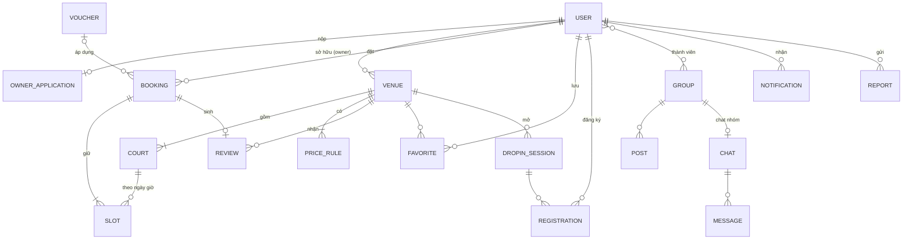

# Thiết kế cơ sở dữ liệu (Firestore + Supabase Storage)

Tài liệu này là **đặc tả CSDL dùng chung** của SmashNow. Dữ liệu nghiệp vụ nằm trong **Cloud Firestore** (Firebase gói Spark). Ảnh nằm trong **Supabase Storage**, thao tác phía server chạy bằng **Supabase Edge Functions** (gói Free), theo constitution v1.1.0. Nó chốt quy ước, danh sách collection, người chịu trách nhiệm từng collection và các ràng buộc giữa các nhóm tính năng. Chi tiết riêng của một tính năng (query cụ thể, contract, test) vẫn viết trong `specs/NNN-.../data-model.md` và phải khớp với file này.

Trạng thái: 🟨 Bản nháp, chốt tại buổi họp 16/10/2026 (mốc M1). Phân công xem [w1-w2-spec-assignment.md](../../guides/w1-w2-spec-assignment.md).

## 1. Quy ước chung

| Hạng mục | Quy ước |
|---|---|
| Tên collection | `camelCase`, số nhiều: `users`, `venues`, `dropInSessions` |
| Tên trường | `camelCase`. Khóa ngoại đặt tên `<thựcThể>Id`: `userId`, `venueId`, `courtId` |
| ID document | ID tự sinh của Firestore, trừ các trường hợp ID tất định ở [mục 5](#5-id-tất-định) |
| Thời gian | `Timestamp` (UTC). Ngày dùng để truy vấn lưu thêm dạng chuỗi `yyyyMMdd` theo giờ `Asia/Ho_Chi_Minh` |
| Giờ trong ngày | Chuỗi `HHmm` (ví dụ `"1730"`) |
| Tiền | `Long`, đơn vị VND. Không dùng `Double` |
| Enum | Chuỗi IN HOA: `PENDING`, `CONFIRMED`. Mỗi enum được liệt kê trong file này |
| Trường hệ thống | Mọi document có `createdAt`, `updatedAt` (ghi bằng `serverTimestamp()`) |
| Xóa | Ưu tiên xóa mềm bằng trường `status` (`HIDDEN`, `LOCKED`, `DELETED`) cho dữ liệu có liên kết |
| Phi chuẩn hóa | Được phép sao chép trường hiển thị (tên sân, ảnh đại diện) để tránh đọc thêm. Bản sao ghi rõ là `*Snapshot` hoặc nêu trong bảng trường |
| Trường chỉ server ghi | Đánh dấu 🔒 trong bảng. Client không được ghi, Rules phải chặn |

Các trường 🔒 do Edge Functions ghi qua Firestore REST API bằng service account (bỏ qua Rules). Mã truy cập Firestore dùng chung đặt ở `supabase/functions/_shared/firestore.ts` (B phụ trách).

## 2. Danh sách collection và người phụ trách

Người phụ trách viết bảng trường chi tiết, index, Rules và test Emulator cho collection đó. Người khác cần thêm trường thì mở issue hoặc comment vào PR của người phụ trách, không tự sửa.

| Collection | Mô tả | Phụ trách | Nhóm đọc/ghi |
|---|---|---|---|
| `users/{uid}` | Hồ sơ người dùng, vai trò | **A** | 01, mọi nhóm đọc |
| `users/{uid}/searchHistory/{id}` | Lịch sử tìm kiếm | **A** | 02 |
| `users/{uid}/aiUsage/{yyyyMMdd}` | Số lượt dùng AI Assistant trong ngày, số câu lạc đề liên tiếp 🔒 | **A** | 02 (AI) |
| `aiSearchCache/{hash}` | Kết quả phân tích của câu đã chuẩn hóa, hết hạn trong ngày 🔒 | **A** | 02 (AI) |
| `districts/{id}`, `amenities/{id}` | Danh mục khu vực, tiện ích | **A** | 02, 03, 11 đọc; 12 ghi |
| `ownerApplications/{id}` | Hồ sơ đăng ký chủ sân | **D** | 01 đọc, 11 tạo, 12 duyệt |
| `venues/{venueId}` | Cơ sở (cụm sân) | **D** | 11 ghi; 02, 03 đọc |
| `venues/{venueId}/courts/{courtId}` | Sân con | **D** | 11 ghi; 03, 04 đọc |
| `venues/{venueId}/priceRules/{id}` | Bảng giá theo khung giờ | **D** | 11 ghi; 03, 04 đọc |
| `slots/{slotId}` | Trạng thái từng khung giờ của sân con | **B** | 04 ghi (transaction); 11 khóa giờ |
| `bookings/{bookingId}` | Đơn đặt sân | **B** | 04, 05, 06; 11 duyệt |
| `vouchers/{code}` | Mã khuyến mãi | **B** | 05 áp dụng; 11 tạo |
| `reviews/{reviewId}` | Đánh giá sân/buổi vãng lai | **C** | 07, 08; 11 phản hồi |
| `users/{uid}/favorites/{venueId}` | Sân yêu thích (= theo dõi) | **C** | 07; 10 đọc để gửi khuyến mãi |
| `dropInSessions/{id}` | Buổi chơi vãng lai | **C** | 08 đọc; 11 tạo |
| `dropInSessions/{id}/registrations/{uid}` | Đăng ký, hàng chờ | **C** | 08; 11 check-in |
| `groups/{groupId}` (+ `members`, `posts`) | Nhóm/CLB và bảng tin | **C** | 09 |
| `chats/{chatId}` (+ `messages`) | Hội thoại nhóm/riêng | **C** | 09 |
| `reports/{reportId}` | Báo cáo vi phạm | **D** | 07, 09 tạo; 12 xử lý |
| `users/{uid}/notifications/{id}` | Hộp thư thông báo | **D** | 10; mọi nhóm phát sinh qua Edge Functions |
| `venues/{venueId}/dailyStats/{yyyyMMdd}` | Thống kê theo ngày | **D** | 11, 12 đọc 🔒 |
| `systemStats/{yyyyMMdd}` | Thống kê toàn hệ thống | **D** | 12 đọc 🔒 |

## 3. Sơ đồ ER



Người tích hợp tuần 2 cập nhật sơ đồ này sau khi ghép các `data-model.md`, xuất thêm ảnh `er-diagram.png` vào thư mục này.

## 4. Bảng trường của các collection

Các bảng dưới đây là bản khởi đầu. Người phụ trách hoàn thiện (thêm trường, kiểu, bắt buộc hay không) trong `data-model.md` của spec tương ứng rồi cập nhật lại đây.

### 4.1. `users/{uid}` — A

| Trường | Kiểu | Ghi chú |
|---|---|---|
| `displayName` | String | |
| `email`, `phone` | String? | Ít nhất một trong hai |
| `avatarPath` | String? | Bucket `avatars`, object `{uid}/avatar.jpg` |
| `level` | String | `BEGINNER`, `INTERMEDIATE`, `ADVANCED` |
| `favoriteDistrictIds` | Array\<String> | Khu vực hay chơi |
| `role` 🔒 | String | `PLAYER`, `OWNER`, `ADMIN`. Bản sao của custom claim `appRole` |
| `ownerStatus` 🔒 | String | `NONE`, `PENDING`, `APPROVED`, `REJECTED` |
| `accountStatus` 🔒 | String | `ACTIVE`, `LOCKED` |
| `fcmTokens` | Array\<String> | Chỉ chủ tài khoản ghi |
| `notificationPrefs` | Map\<String, Boolean> | Theo loại thông báo ở [4.13](#413-usersuidnotificationsid--d) |
| `termsAcceptedAt` | Timestamp | Bắt buộc khi đăng ký |

Xóa tài khoản: Edge Function `delete-account` xóa document, ảnh, lịch sử tìm kiếm, yêu thích; ẩn danh hóa `userId` trong đơn đặt và đánh giá cũ.

**AI Assistant (spec 022):**
- `users/{uid}/aiUsage/{yyyyMMdd}` 🔒: `count` (Int, số lượt trong ngày), `offTopicStreak` (Int), `lockedUntil` (Timestamp?, tạm khóa sau 3 câu lạc đề liên tiếp). Chỉ Edge Function ghi; chủ tài khoản được đọc để hiển thị số lượt còn lại.
- `aiSearchCache/{hash}` 🔒: `hash` = SHA-256 của câu đã chuẩn hóa + ngày; `result` (Map, JSON đã kiểm tra), `expiresAt` (Timestamp, hết ngày). Không lưu câu gốc hay thông tin người dùng. Client không đọc/ghi.

### 4.2. `ownerApplications/{id}` — D

`uid`, `venueDraft` (Map: tên, địa chỉ, tọa độ, số sân, giờ mở cửa), `representativeName`, `representativePhone`, `documentPaths` (Array, object trong bucket private `owner-docs`), `status` 🔒 (`PENDING`, `APPROVED`, `REJECTED`), `rejectReason` 🔒 (bắt buộc khi từ chối), `reviewedBy` 🔒, `reviewedAt` 🔒, `submittedAt`.

Duyệt hồ sơ chạy bằng Edge Function `review-owner-application`: set custom claim `appRole=OWNER`, cập nhật `users.role/ownerStatus`, tạo `venues` từ `venueDraft`, gửi thông báo.

### 4.3. `venues/{venueId}` — D

| Trường | Kiểu | Ghi chú |
|---|---|---|
| `ownerId` | String | |
| `name` | String | |
| `nameKeywords` | Array\<String> | Tiền tố chữ thường, bỏ dấu, dùng cho tìm theo tên (A định nghĩa cách sinh) |
| `address`, `districtId` | String | |
| `location` | GeoPoint | |
| `geohash` | String | Dùng cho truy vấn "gần tôi" (GeoFire utils) |
| `openTime`, `closeTime` | String `HHmm` | Có thể mở rộng thành Map theo thứ |
| `phone` | String | |
| `amenityIds` | Array\<String> | Lọc bằng `array-contains-any` |
| `photoPaths` | Array\<String> | Bucket `venue-photos`, object `{venueId}/...`. URL công khai ghép từ path |
| `courtCount` | Int | |
| `minPricePerHour` 🔒 | Long | Tính lại khi đổi bảng giá, phục vụ lọc/sắp xếp theo giá |
| `ratingAvg` 🔒, `ratingCount` 🔒 | Double, Int | Cập nhật khi có đánh giá mới |
| `status` | String | `ACTIVE`, `HIDDEN` (chủ sân ẩn), `LOCKED` 🔒 (admin khóa) |

**Sân con `courts/{courtId}`:** `name`, `surfaceType` (`WOOD`, `PU`, `MAT`), `isActive`, `sortOrder`.

**Bảng giá `priceRules/{id}`:** `daysOfWeek` (Array\<Int> 1–7), `startTime`, `endTime` (`HHmm`), `pricePerSlot` (Long), `label` (`NORMAL`, `PEAK`, `WEEKEND`). Các rule cùng ngày không được chồng giờ.

### 4.4. `slots/{courtId}_{yyyyMMdd}_{HHmm}` — B

Một document cho mỗi khung giờ **đang bị chiếm**. Không có document nghĩa là khung giờ trống.

| Trường | Kiểu | Ghi chú |
|---|---|---|
| `venueId`, `courtId` | String | |
| `date` | String `yyyyMMdd` | Lưới giờ truy vấn theo `venueId` + `date` |
| `startAt`, `endAt` | Timestamp | |
| `status` | String | `HOLD`, `BOOKED`, `BLOCKED` |
| `bookingId` | String? | Khi `HOLD`/`BOOKED` |
| `holdBy` | String? | `uid` người đang giữ |
| `holdExpiresAt` | Timestamp? | `serverTimestamp + 5 phút`. Đã hết hạn coi như trống |
| `blockReason` | String? | `MAINTENANCE`, `EVENT`, `WALK_IN`, `DROP_IN` (khi `BLOCKED`) |

Độ dài khung giờ: **30 phút** (thống nhất đồng bộ giữa B và D theo spec 111/112 và spec 040/041). Mở buổi vãng lai (11) phải ghi `BLOCKED` với `blockReason = DROP_IN` cho các slot của buổi đó, trong transaction.

### 4.5. `bookings/{bookingId}` — B

`bookingId` = `requestId` (UUID client sinh khi bấm xác nhận) để chống tạo đơn trùng.

| Trường | Kiểu | Ghi chú |
|---|---|---|
| `userId`, `venueId` | String | |
| `venueSnapshot` | Map | `name`, `address`, `photoUrl` |
| `items` | Array\<Map> | `courtId`, `courtName`, `slotId`, `startAt`, `endAt`, `price` |
| `recurringGroupId` | String? | Các đơn đặt cố định theo tuần dùng chung ID |
| `status` 🔒 | String | Xem máy trạng thái bên dưới |
| `subtotal`, `discount`, `total` 🔒 | Long | Tính ở server |
| `voucherCode` | String? | |
| `paymentMethod` | String | `AT_VENUE`, `DEPOSIT`, `MOCK_WALLET` |
| `paymentStatus` 🔒 | String | `UNPAID`, `DEPOSITED`, `PAID`, `REFUNDED` |
| `depositAmount` 🔒 | Long | |
| `holdExpiresAt` | Timestamp | |
| `qrToken` 🔒 | String | Chuỗi ngẫu nhiên, sinh khi `CONFIRMED` |
| `checkedInAt` 🔒 | Timestamp? | |
| `cancelReason`, `cancelledBy` | String? | `USER`, `OWNER`, `SYSTEM` |
| `rescheduleRequest` | Map? | `newItems`, `status` (`PENDING`, `ACCEPTED`, `DECLINED`) |

**Máy trạng thái đơn:**

```
HOLD ──(chọn thanh toán)──▶ PENDING ──(chủ sân duyệt)──▶ CONFIRMED ──(qua giờ chơi)──▶ COMPLETED
  │                           │  └─(chủ sân từ chối)──▶ REJECTED
  └─(quá 5 phút)──▶ EXPIRED   └──────────┬──────────────────┘
                                         ▼
                                     CANCELLED (người chơi hủy theo chính sách / chủ sân hủy)
```

Mọi chuyển trạng thái khác bị Rules/Edge Functions chặn. Khi đơn sang `EXPIRED`, `REJECTED`, `CANCELLED` thì xóa các document `slots` của đơn trong cùng transaction.

### 4.6. `vouchers/{code}` — B

`venueId` (null = voucher toàn hệ thống do admin tạo), `type` (`PERCENT`, `FIXED`), `value`, `maxDiscount`, `minOrderTotal` (Long), `validFrom`, `validTo`, `usageLimit`, `usedCount` 🔒, `perUserLimit`, `isActive`. Lượt dùng lưu ở `vouchers/{code}/redemptions/{bookingId}` (`userId`, `usedAt`) 🔒.

### 4.7. `reviews/{reviewId}` — C

`reviewId` = `bookingId` hoặc `{sessionId}_{uid}` để mỗi đơn/lượt chỉ đánh giá một lần.

`targetType` (`VENUE`, `DROP_IN`), `venueId`, `sessionId?`, `userId`, `userSnapshot` (tên, ảnh), `ratings` (Map: `court`, `cleanliness`, `service`, 1–5), `overall` (Double), `comment`, `photoPaths`, `ownerReply` (Map: `text`, `repliedAt`), `status` (`VISIBLE`, `HIDDEN` 🔒). Rules chỉ cho tạo khi đơn tương ứng `COMPLETED` và thuộc người viết.

### 4.8. `users/{uid}/favorites/{venueId}` — C

`venueSnapshot` (tên, ảnh, địa chỉ), `createdAt`. Yêu thích đồng thời là "theo dõi" để nhận khuyến mãi (nhóm 10). C và D chốt điều này trong clarify.

### 4.9. `dropInSessions/{id}` và `registrations/{uid}` — C

**Buổi:** `venueId`, `ownerId`, `districtId`, `courtIds`, `date`, `startAt`, `endAt`, `level`, `capacity`, `registeredCount` 🔒, `pricePerPerson` (Long), `status` (`OPEN`, `FULL`, `CANCELLED`, `COMPLETED`), `note`.

**Đăng ký:** `partySize`, `status` (`REGISTERED`, `WAITLISTED`, `CANCELLED`, `CHECKED_IN`), `paymentMethod`, `amount`, `qrToken` 🔒, `waitlistedAt`, `requestId`. Đăng ký, hủy và đẩy người từ hàng chờ lên đều chạy trong transaction trên document buổi (`registeredCount`).

### 4.10. `groups/{groupId}` — C

**Nhóm:** `name`, `description`, `avatarUrl`, `districtId`, `ownerId`, `memberCount` 🔒, `visibility` (`PUBLIC`, `PRIVATE`). Con: `members/{uid}` (`role`: `OWNER`, `ADMIN`, `MEMBER`; `joinedAt`), `posts/{postId}` (`authorId`, `type`: `POST`, `EVENT`; `content`, `photoPaths`, `eventAt?`, `status`).

### 4.11. `chats/{chatId}` — C

`type` (`GROUP`, `DIRECT`), `memberIds` (Array, dùng cho Rules và truy vấn `array-contains`), `groupId?`, `venueId?` (chat với chủ sân), `lastMessage` (Map), `updatedAt`. Chat riêng dùng ID tất định `{uidNhỏ}_{uidLớn}`. Con: `messages/{id}` (`senderId`, `text`, `imagePath`, `createdAt`, `status`).

### 4.12. `reports/{reportId}` — D

`reporterId`, `targetType` (`POST`, `MESSAGE`, `REVIEW`, `VENUE`, `USER`, `DROP_IN`), `targetPath` (đường dẫn document), `reason`, `detail`, `status` 🔒 (`OPEN`, `RESOLVED`, `DISMISSED`), `action` 🔒 (`NONE`, `HIDE_CONTENT`, `LOCK_USER`, `LOCK_VENUE`), `handledBy` 🔒, `handledAt` 🔒.

### 4.13. `users/{uid}/notifications/{id}` — D

`type`, `title`, `body`, `data` (Map: `bookingId`, `sessionId`, ...), `isRead`, `createdAt`. Client chỉ được sửa `isRead`.

Các `type` (mỗi nhóm phát sinh thông báo báo cho D trước 14/10):

| type | Phát sinh từ |
|---|---|
| `BOOKING_CONFIRMED`, `BOOKING_REJECTED`, `BOOKING_CANCELLED`, `BOOKING_REMINDER` | 04, 06, 11 |
| `DROPIN_REGISTERED`, `DROPIN_SPOT_OPENED`, `DROPIN_CHANGED` | 08, 11 |
| `PROMOTION` | 05, 11 (voucher của sân đang theo dõi) |
| `OWNER_APPROVED`, `OWNER_REJECTED` | 12 |
| `REVIEW_REPLIED`, `CHAT_MESSAGE` | 07, 09 |
| `SYSTEM` | 12 |

## 5. ID tất định

| Document | ID | Lý do |
|---|---|---|
| `slots` | `{courtId}_{yyyyMMdd}_{HHmm}` | Hai người đặt cùng slot tranh chấp đúng một document (constitution III) |
| `bookings` | `requestId` (UUID) | Bấm nhiều lần không tạo đơn trùng |
| `reviews` | `bookingId` / `{sessionId}_{uid}` | Mỗi đơn chỉ đánh giá một lần |
| `registrations` | `uid` | Mỗi người một đăng ký mỗi buổi |
| `favorites` | `venueId` | Không trùng |
| `chats` (riêng) | `{uidNhỏ}_{uidLớn}` | Không tạo hai hội thoại cho cùng một cặp |

## 6. Index dự kiến

Người phụ trách bổ sung vào `firestore.indexes.json` khi viết `plan.md`.

| Collection | Trường | Dùng cho |
|---|---|---|
| `venues` | `status`, `districtId`, `minPricePerHour` | Tìm theo quận, lọc/sắp xếp giá (02) |
| `venues` | `status`, `ratingAvg desc` | Sắp xếp theo đánh giá (02) |
| `venues` | `status`, `nameKeywords` (array-contains) | Tìm theo tên (02) |
| `venues` | `geohash` | Gần tôi (02) |
| `slots` | `venueId`, `date` | Lưới khung giờ (04), lịch tổng hợp (11) |
| `bookings` | `userId`, `status`, `startAt` | Lịch của tôi (06) |
| `bookings` | `venueId`, `status`, `startAt` | Duyệt đơn, lịch chủ sân (11) |
| `reviews` | `venueId`, `status`, `createdAt desc` | Chi tiết sân (03) |
| `dropInSessions` | `districtId`, `date`, `status` | Danh sách vãng lai (08) |
| `chats` | `memberIds` (array-contains), `updatedAt desc` | Danh sách hội thoại (09) |
| `reports` | `status`, `createdAt` | Hàng đợi xử lý (12) |
| `ownerApplications` | `status`, `submittedAt` | Hồ sơ chờ duyệt (12) |

## 7. Phân quyền (tóm tắt Security Rules)

Ký hiệu: R đọc, C tạo, U sửa, D xóa. "Chủ" = người sở hữu document. "Owner sân" = `request.auth.token.appRole == 'OWNER'` và `venues.ownerId == uid`. "Server" = Edge Function dùng service account.

| Collection | Người chơi | Owner sân | Admin | Server (Edge Functions) |
|---|---|---|---|---|
| `users` | R mọi người (trường công khai), CU của mình trừ 🔒 | như người chơi | R, U `accountStatus` | Ghi 🔒 |
| `aiUsage`, `aiSearchCache` | R `aiUsage` của mình; không ghi | như người chơi | R | Ghi toàn bộ |
| `ownerApplications` | C, R của mình; U khi `REJECTED` (nộp lại) | R của mình | R, duyệt qua Edge Function | Ghi 🔒 |
| `venues`, `courts`, `priceRules` | R khi `ACTIVE` | CRUD cơ sở của mình (trừ 🔒) | R, khóa | Ghi 🔒 |
| `slots` | R; C/U chỉ trong transaction đặt sân với `holdBy == uid` | C/D `BLOCKED` cho sân của mình | R | Dọn slot hết hạn |
| `bookings` | C `HOLD` của mình, R của mình, U → `CANCELLED` theo chính sách | R đơn sân mình, U duyệt/từ chối | R | Tính tiền, `EXPIRED`, `COMPLETED` |
| `vouchers` | R voucher đang hiệu lực | CRUD voucher sân mình | CRUD toàn hệ thống | Ghi `usedCount` |
| `reviews` | C khi đơn `COMPLETED`, U/D của mình | U `ownerReply` cho sân mình | U `status` | Cập nhật `ratingAvg` |
| `dropInSessions` | R | CRUD buổi sân mình | R, khóa | Ghi `registeredCount` |
| `groups`, `chats` | Thành viên R/C; nhóm `PUBLIC` ai cũng R | như người chơi | R để kiểm duyệt | |
| `reports` | C | C | R, U | |
| `notifications` | R, U `isRead` của mình | như người chơi | C (thông báo hệ thống) | C |

Mỗi dòng trên cần ít nhất một test Emulator "được phép" và một test "bị chặn".

## 8. Supabase Storage

Ảnh lưu trong Supabase Storage. Firestore chỉ lưu **path** của object (không lưu URL đầy đủ) để đổi bucket hay domain không phải sửa dữ liệu. Supabase nhận diện người dùng bằng Firebase ID token (Third-party Auth): `auth.jwt() ->> 'sub'` là Firebase `uid`, `auth.jwt() ->> 'appRole'` là vai trò.

| Bucket | Loại | Object | Ai được ghi | Ai được đọc | Phụ trách |
|---|---|---|---|---|---|
| `avatars` | public | `{uid}/avatar.jpg` | Chủ (`sub == uid`) | Mọi người | A |
| `venue-photos` | public | `{venueId}/{tên file}` | Owner sân (kiểm tra qua Edge Function `sign-upload`) | Mọi người | D |
| `review-photos` | public | `{reviewId}/{tên file}` | Người viết | Mọi người | C |
| `owner-docs` | **private** | `{uid}/{applicationId}/{tên file}` | Chủ | **Chỉ chủ và `appRole == ADMIN`**, qua signed URL hết hạn sau 5 phút | D |
| `group-media` | private | `{groupId}/{tên file}` | Thành viên | Thành viên, qua signed URL | C |
| `chat-media` | private | `{chatId}/{tên file}` | Thành viên chat | Thành viên chat, qua signed URL | C |

- Chính sách RLS chỉ đọc được JWT, không đọc được Firestore. Quyền nào cần dữ liệu Firestore (owner của `venueId` nào, thành viên của `chatId` nào) thì app gọi Edge Function `sign-upload` hoặc `sign-download`; Edge Function kiểm tra Firestore rồi trả signed URL.
- Giới hạn: ảnh ≤ 2 MB, MIME `image/jpeg`, `image/png`, `image/webp` (đặt ở cấu hình bucket). Ảnh được nén ở client trước khi upload.
- Chính sách bucket viết trong `supabase/migrations/` và có test chạy trên Supabase local.
- Tổng dung lượng gói Free khoảng 1 GB: chỉ dùng ảnh demo nhỏ, ảnh sân ≤ 5 ảnh/cơ sở.

## 8a. Edge Functions dự kiến

| Function | Việc | Phụ trách |
|---|---|---|
| `on-signup` | Gán claim `role: "authenticated"`, `appRole: "PLAYER"`; tạo `users/{uid}` | A |
| `delete-account` | Xóa dữ liệu và ảnh của người dùng | A |
| `ai-search-parse` | AI Assistant: kiểm tra lượt dùng và cache, gọi LLM, kiểm tra JSON theo schema, trả bộ lọc (xem [AI-feature.md](../../proposal/AI-feature.md)) | A |
| `create-booking`, `cancel-booking` | Transaction giữ chỗ/đặt/hủy, tính tiền, áp voucher | B |
| `expire-holds` (pg_cron mỗi phút) | Chuyển đơn `HOLD` quá hạn sang `EXPIRED`, xóa slot | B |
| `register-drop-in`, `cancel-drop-in` | Transaction đăng ký, hàng chờ | C |
| `on-review-created` | Cập nhật `ratingAvg`, `ratingCount` | C |
| `review-owner-application` | Duyệt/từ chối chủ sân, gán `appRole=OWNER` | D |
| `sign-upload`, `sign-download` | Cấp signed URL cho bucket cần kiểm tra Firestore | D |
| `send-notification`, `booking-reminders` (pg_cron) | Ghi `notifications`, gửi FCM HTTP v1 | D |
| `daily-stats` (pg_cron mỗi đêm) | Cộng dồn `dailyStats`, `systemStats` | D |

## 9. Điểm cần chốt khi `/speckit-clarify`

| # | Câu hỏi | Người chốt |
|---|---|---|
| 1 | ~~Độ dài một slot: 30 hay 60 phút?~~ Đã chốt 10/10: Cố định **30 phút** toàn hệ thống | B, D |
| 2 | Đơn có cần chủ sân duyệt không, hay một số sân tự động xác nhận? | B, D |
| 3 | Chính sách hủy cụ thể (mốc 4 giờ, hoàn cọc bao nhiêu %) | B |
| 4 | "Sân yêu thích" và "sân đang theo dõi" có là một không? | C, D |
| 5 | ~~Có bật gói Blaze không?~~ Đã chốt 05/10: không dùng Blaze; Storage và Functions chuyển sang Supabase | Cả nhóm |
| 6 | Tìm theo tên bằng `nameKeywords` hay dùng dịch vụ tìm kiếm ngoài? | A |
